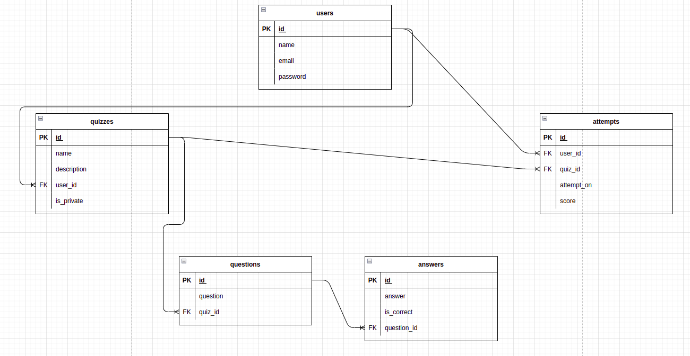

# Quiz App

### Main Contributors: [Mikiyoshi Kokura](https://github.com/mikiyoshi), [Pouya Elishaee](https://github.com/Paules2021), [Paxton Nguyen](https://github.com/pax-n)

## Overview

For this group project, we created simple quiz app called Kazoot!
This app users can take a simple quiz and make a original quiz. Users also have a profile that can inform other users as a quiz author. For now people work from home, take a online school or take a online job interview. So we are difficult physical small talk with someone by accident.
But this app can support small talk by online. When you take the quiz, users can post to author LinkedIn recommendation and skills. Users also request social connection or share your quiz. This is not a very strong professional skills refference, but If someone didn’t have professional skills work experience, it will be support in your first step.

## Final Product

## Project Setup

The following steps are only for _one_ of the group members to perform.

1. Create your own copy of this repo using the `Use This Template` button, ideally using the name of your project. The repo should be marked Public
2. Verify that the skeleton code now shows up in your repo on GitHub, you should be automatically redirected
3. Clone your copy of the repo to your dev machine
4. Add your team members as collaborators to the project so that they can push to this repo
5. Let your team members know the repo URL so that they use the same repo (they should _not_ create a copy/fork of this repo since that will add additional workflow complexity to the project)

## Getting Started

1. Create the `.env` by using `.env.example` as a reference: `cp .env.example .env`
2. Update the .env file with your correct local information

- username: `labber`
- password: `labber`
- database: `midterm`

3. Install dependencies: `npm i`
4. Fix to binaries for sass: `npm rebuild node-sass`
5. Install `npm install body-parser`
6. Install `npm install cookie-parser`
7. Install `npm install bcryptjs`
8. Reset database: `npm run db:reset`

- Check the db folder to see what gets created and seeded in the SDB

9. Run the server: `npm run local`

- Note: nodemon is used, so you should not have to restart your server

10. Visit `http://localhost:8080/`

## Warnings & Tips

- Do not edit the `layout.css` file directly, it is auto-generated by `layout.scss`
- Split routes into their own resource-based file names, as demonstrated with `users.js` and `widgets.js`
- Split database schema (table definitions) and seeds (inserts) into separate files, one per table. See `db` folder for pre-populated examples.
- Use the `npm run db:reset` command each time there is a change to the database schema or seeds.
  - It runs through each of the files, in order, and executes them against the database.
  - Note: you will lose all newly created (test) data each time this is run, since the schema files will tend to `DROP` the tables and recreate them.

## Dependencies

- Node 10.x or above
- NPM 5.x or above
- PG 6.x
- Express
- jQuery
- PostgreSQL

## Contact the Contributors

Questions? Comments? Want to contribute to this? Feel free to contact any of the contributors of this repo.
